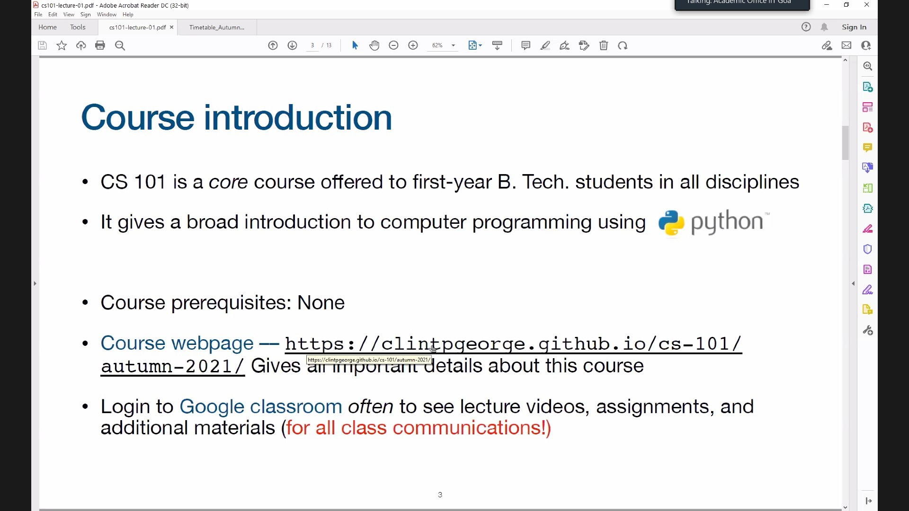

# Arnav Prasad Kamat  

---

## Education

| Year of graduation | Degree | Institution |
| ----- | ----- | ----- |
| 2025 | B.tech | IIT Goa |
| 2021 | 12th standard | Shahu college |
| 2019 | 10th standard | Chhatrapati shahu vidlaya |

---

## 1st year courses @IIT Goa
### Autumn
* **CS101**: Introduction to computing *Cling P. George* [Link](https://clintpgeorge.github.io/cs-101/autumn-2021/)
* **CH104**: Chemistry Lab II *Vaibhav Wasnik* 
* **CH101**: Quantum Physics *Mantu sir* 
* **CH102**: Inorganic chemistry *Santosh sir* 
* **NO101**: Sports *Santosh sir* 
### Spring
1. **CS102**: Software tools *Clint P. George*
1. **PH102**: Electricity and Magnetism *Vaibhav Wasnik*
1. **Bio101**: Biology *Sreenath Balkrishnan*
1. **NO102**: Sports *Santosh sir*

---

